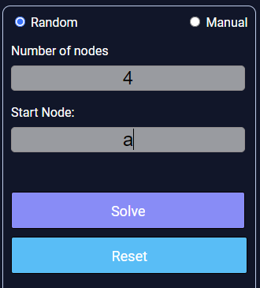
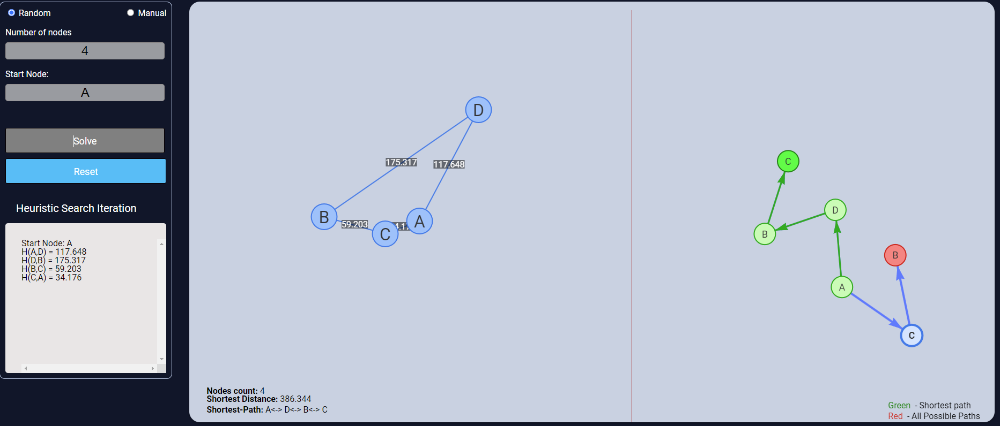
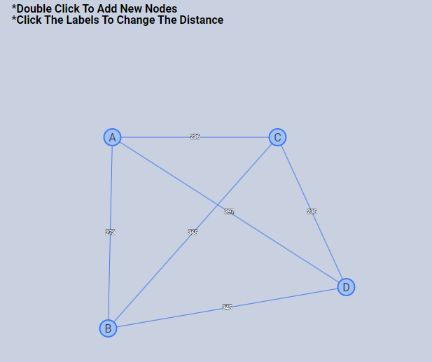
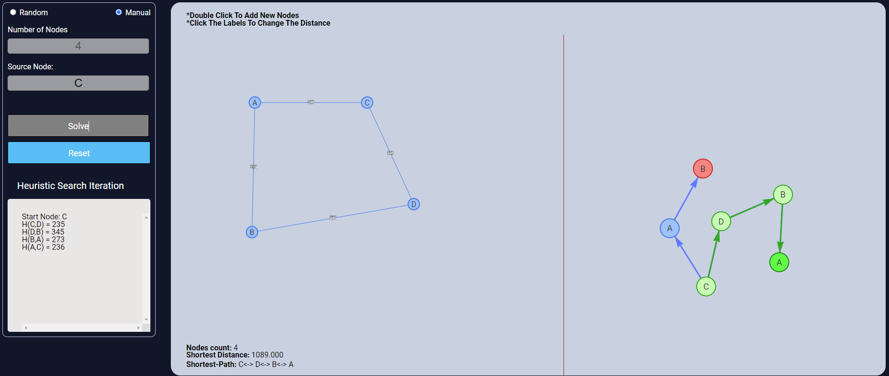

## Procedure

1. There are two modes: Random and Manual. By default, the Random mode loads a random graph.
2. "Number of nodes" refers to the count of nodes displayed in the graph.
3. "Start node" allows the user to choose the starting node.
4. Press the "Solve" button to initiate the algorithm and start the simulation process.
5. The canvas is divided into two sections. The left portion represents the graph, while the right portion displays all the possible paths in a tree structure.
6. If the user selects Manual mode, they can create their own graph by clicking on the canvas.
7. After creating the graph, enter the start node and click the "Solve" button.
8. The algorithm will begin running and show the graph method and the tree method on the canvas.
9. To create another graph, click the "Reset" button. This will clear everything, allowing the user to create a new graph.

### Random

 

 

### Manual

 

 

 

