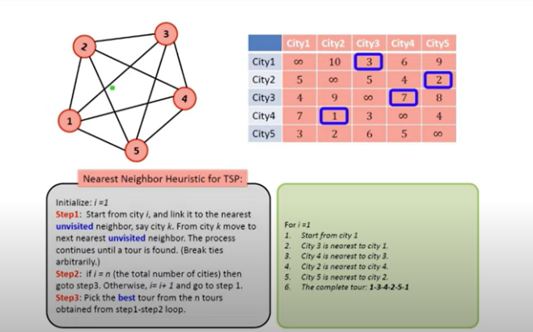

# Theory

## Heuristics Search
To find the global optimum, we randomly start from a point and look at the neighboring points. If we find a point that is better than the current one, we move in its direction. Then, we do the same for the new point until we reach a point where there’s no better one in its vicinity.

## Traveling Salesman Problem (TSP) using Heuristics Search

1. We consider a city as the starting and ending point. We can use any city as a starting point because the route is cyclic.

2. start traversing from the source to its adjacent nodes.

3. Find the cost of each traversal and keep track of minimum cost and keep on updating the value of minimum cost stored value.

 
4. In the end, return the permutation with minimum cost.

