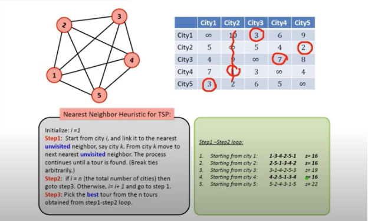

# Theory

<h3> Heuristics Search</h3>

Heuristics are used in situations in which there is the requirement of a short-term solution. On facing complex situations with limited resources and time, Heuristics can help  to make a quick decisions by shortcuts and approximated calculations.

<h4>Traveling Salesman Problem (TSP) using Heuristics Search</h4>
<ol>
<li><b>Initialization:</b></li>
<ul><li> Start at any city as the initial node.</li>
</ul>

<li><b>Node Exploration:</b></li>
<ul><li> From the current city, explore neighboring cities (other cities that haven't been visited yet). These neighboring cities represent the immediate options or choices available from the current location.

</li>
</ul>
<li><b>Heuristic Evaluation:</b></li>
<ul><li> Evaluate each neighboring city based on a heuristic function. This function estimates the distance to travel from the current city to each neighboring city and back to the starting city. Cities with lower heuristic values (indicating shorter distances) are considered more promising options.</li>
</ul>
<li><b>Selection of Next Node: </b></li>
<ul><li> Choose the neighboring city with the lowest heuristic value, indicating that it's likely to lead to a shorter overall tour.

</li>
</ul>
<li><b>Move to Next Node:</b></li>
<ul><li> Move to the selected neighboring city and repeat the process, exploring its neighbors, evaluating them based on the heuristic function, and selecting the next city to move to.</li>
</ul>
<li><b>Termination: </b></li>
<ul><li>  Continue this process until all cities have been visited once, forming a complete tour, or until no more promising paths are available.</li>
</ul>

<h5>Example :Nearest Neighbor Heuristic for TSP </h5>
<ul>
<li>step1 , initialization is being performed </li></ul>

 
<ul>
<li>step1 -step2 , loop </li></ul>
 

